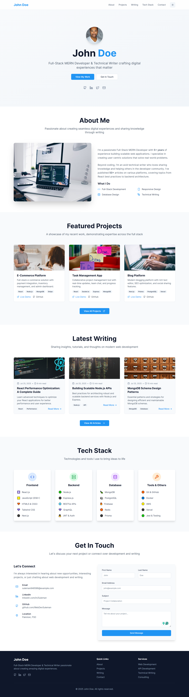
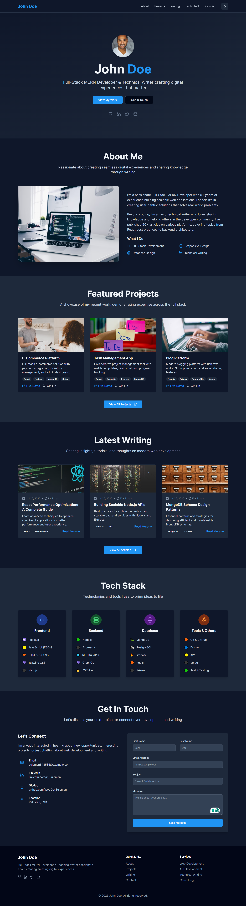

# 🚀 Portfolio Website

A modern, responsive **full-stack portfolio website** built with **React**, **TypeScript**, **Tailwind CSS**, and **Express.js**. Includes a dark/light mode toggle, CMS, project showcase, and contact functionality — perfect for developers and creators.

---

## 📸 Live Preview

### 🔹 Screenshots


<br />
# Dark Theme



---

## ✨ Features

- ✅ **Responsive Design** – Mobile-first, elegant across all devices
- 🌗 **Dark/Light Mode** – Toggle with localStorage persistence
- 🚀 **Project Showcase** – Highlight your top projects with tech badges
- ✍️ **Blog System** – Built-in CMS with Markdown support
- 📬 **Contact Form** – Functional backend integration
- 🔐 **Admin Dashboard** – Manage blog & projects securely
- 🔍 **SEO Optimized** – Meta tags, semantic HTML, and OpenGraph
- ⚡ **Performance Optimized** – Clean, fast, production-ready

---

## 🛠️ Tech Stack

### Frontend

- ⚛️ React 18 + TypeScript
- 🎨 Tailwind CSS
- 🧩 shadcn/ui components
- 🔄 TanStack Query
- 🧭 Wouter (lightweight routing)
- 🧪 React Hook Form + Zod

### Backend

- 🖥 Node.js + Express
- 🔡 TypeScript
- 🌿 Drizzle ORM (PostgreSQL ready)
- 🧠 In-memory dev storage
- 🌐 REST API

---

## ⚙️ Getting Started

### 🔧 Prerequisites

- Node.js v18+
- npm or yarn

### 🚀 Installation

```bash
npm install         # Install dependencies
npm run dev         # Start dev server
npm run build       # Build for production
npm start           # Start production server
